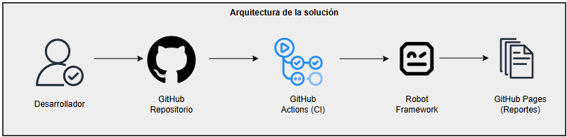

# 🚀 QA Automation y CI usando Robot Framework

Proyecto de **automatización de pruebas E2E** para un sistema de login web, integrando **Robot Framework**, **GitHub Actions (CI)** y **publicación automática de reportes en GitHub Pages**.


📊 **Reporte de la última ejecución (GitHub Pages)**  
👉 https://dmelchor24.github.io/website-tests

🌐 **Demo en vivo de la aplicación**  
👉 https://website-app-psi.vercel.app/

---

## 🧪 Tecnologías utilizadas

- Robot Framework
- SeleniumLibrary
- Python 3.11
- Vercel
- GitHub Actions (CI)
- GitHub Pages (publicación de reportes)
- Chrome (headless / visual)
- HTML, CSS, JavaScript (aplicación bajo prueba)

---

## ⚙️ ¿Qué hace este proyecto?

✔ Simula un sistema real de login/logout  
✔ Ejecuta pruebas automatizadas E2E con Robot Framework  
✔ Corre cada vez que el usuario requiera realizar pruebas
✔ Genera reportes HTML detallados (report, log, output)  
✔ Publica resultados automáticamente en GitHub Pages
✔ Soporta ejecución **local y CI** con `BASE_URL` dinámica  
✔ Diferencia ejecución **headless vs visual**

---

## 🧩 Arquitectura de la solución

El flujo de la solución está diseñado para simular un entorno real de CI/CD:

1. El desarrollador realiza un push al repositorio.
2. GitHub Actions ejecuta el pipeline de CI.
3. Robot Framework ejecuta las pruebas E2E.
4. Los reportes de ejecución se publican en GitHub Pages.



---

## 📁 Estructura del Proyecto

```
├── tests/
│   └── login.robot                 # Casos de prueba principales
├── elementos/
│   └── elementos.robot             # Definición de elementos web
├── variables/
│   └── variables.robot             # Variables de configuración
├── resources/
│   └── common.robot                # Keywords reutilizables
├── scripts/
│   └── execute-tests.py            # Script de ejecución de pruebas
├── results/                        # Resultados de ejecuciones para ambiente local
├── docs/                           # Reportes para GitHub Pages
├── .github/
│   └── workflows/
│       └── robot-tests.yaml        # Configuración CI/CD
├── requirements.txt                # Dependencias Python
├── .gitignore                      # Archivos a ignorar por Git
└── README.md                       # Archivo de explicación del proyecto
```
---

## 🔐 Credenciales de Prueba

El sistema incluye las siguientes credenciales predefinidas para pruebas:

| Usuario    | Contraseña      | Descripción       |
|------------|-----------------|-------------------|
| `testuser` | `testpass123PQ` | Usuario estándar  |
| `admin`    | `admin123PQ`    | Usuario admin     |
| `demo`     | `demo123PQ`     | Usuario demo      |

---

## 🛠️ Instalación y uso local

```bash
git clone https://github.com/dmelchor24/website-tests.git
cd website-tests
pip install -r requirements.txt
python -m http.server 5500
```
**Acceder a la aplicación:**
   - Abrir `http://localhost:5500` en el navegador
   - O usar la demo en vivo: https://website-app-psi.vercel.app

---

## 🧪 Pruebas con Robot Framework

### Ejecutar Pruebas Localmente

```bash
# Ejecutar todas las pruebas
python scripts/execute-tests.py

# Ejecutar con URL personalizada
python scripts/execute-tests.py --base-url=http://localhost:5500

# Ejecutar directamente con Robot Framework
robot --outputdir results tests/
```
---

## 🤖 CI / CD

- CI completo con GitHub Actions
- CD parcial para publicación de reportes
- Preparado para despliegue automático futuro

---

**Nota**: Este sistema está diseñado específicamente para pruebas y desarrollo. No usar en producción sin las medidas de seguridad apropiadas.